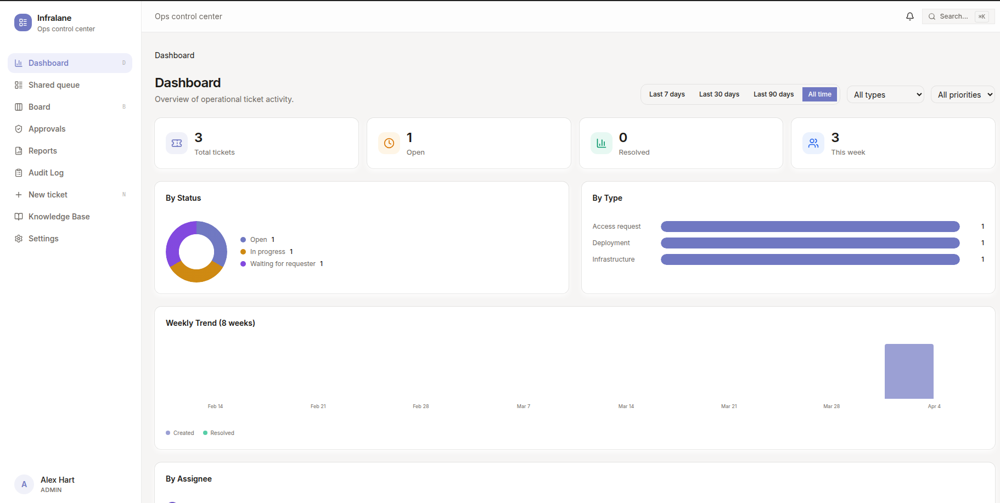
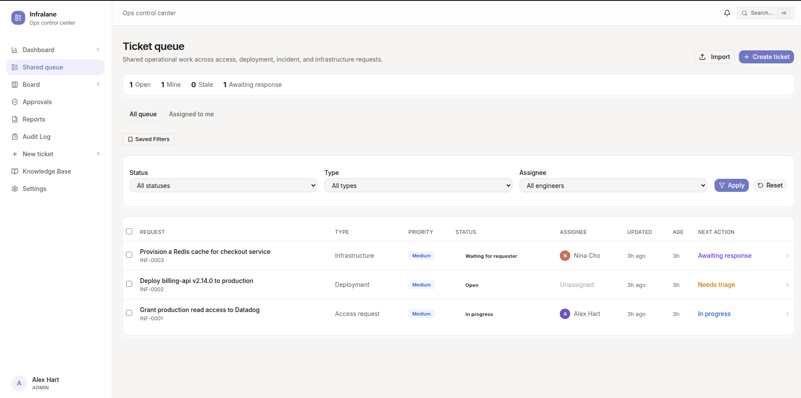
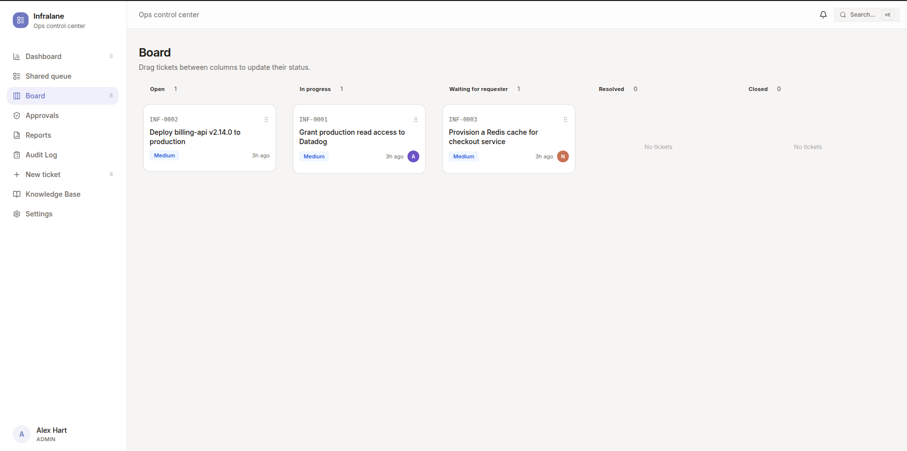
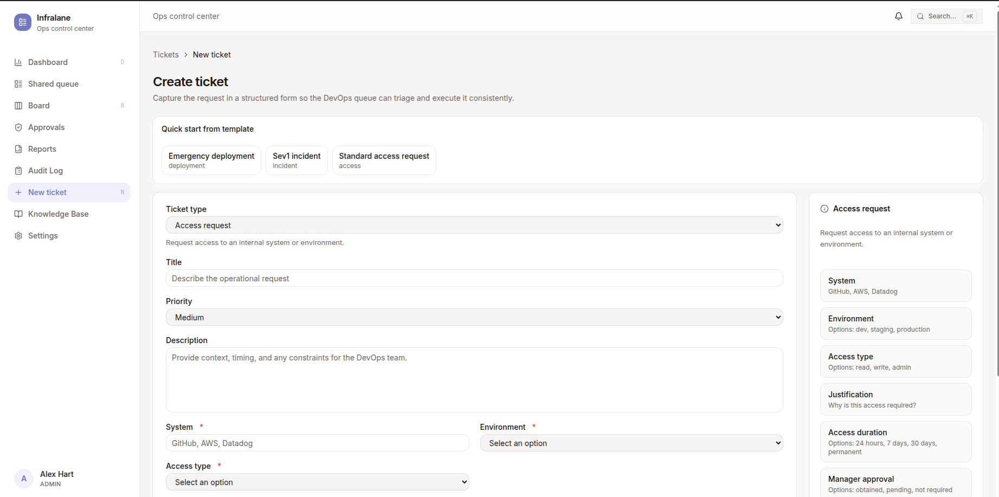
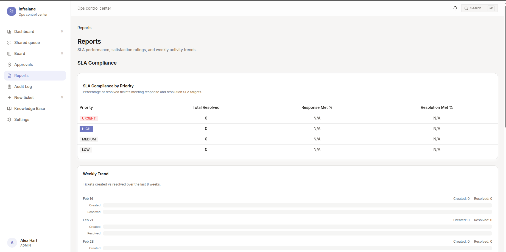
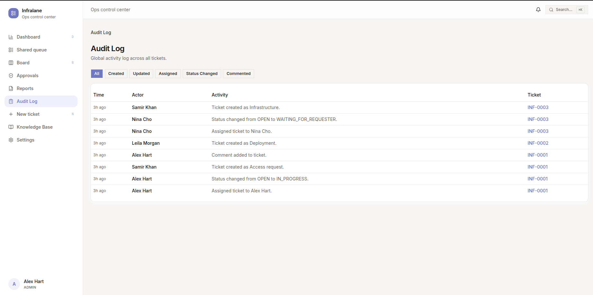
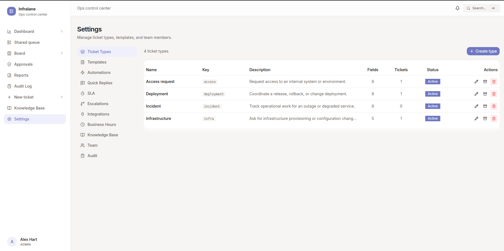

# Infralane

**Structured ops. Automated execution.**

[](https://github.com/infralaneapp/infralane/actions/workflows/ci.yml)
[](./LICENSE)
[](https://railway.com/template/infralane?referralCode=infralane)
[](https://infralane-production.up.railway.app/)

Infralane is an ops control center for DevOps and IT operations teams. Ticket creation triggers automation rules, approvals gate sensitive actions, and every state change is traceable.

> **Try it now:** [Live Demo](https://infralane-production.up.railway.app/) — login with `admin@infralane.com` / `12345678`



## Key Features

- **Structured ticket intake** — Typed requests (access, deployment, incident, infrastructure) with custom field schemas and templates
- **Automation engine** — Rules that trigger on ticket events, evaluate conditions, and execute actions (assign, change status, notify, escalate, webhook)
- **Approval workflows** — Gate automation behind human approval with designated approvers and ticket locking
- **Three-tier roles** — Requester, Operator, Admin with granular permissions
- **SLA tracking** — Configurable response/resolution thresholds with breach detection and auto-escalation
- **Slack integration** — OAuth login, DM notifications, interactive approval buttons
- **Knowledge base** — Self-service articles linked to ticket types
- **Full audit trail** — Every mutation logged with automation job lifecycle events

## Screenshots

<details>
<summary>Ticket Queue</summary>


</details>

<details>
<summary>Board View</summary>


</details>

<details>
<summary>Create Ticket (with templates)</summary>


</details>

<details>
<summary>Reports</summary>


</details>

<details>
<summary>Audit Log</summary>


</details>

<details>
<summary>Settings</summary>


</details>

## Quick Start

### Deploy to Railway (cloud)

1. Click the **Deploy on Railway** badge above
2. Railway auto-provisions PostgreSQL
3. Set one variable: `INFRALANE_SESSION_SECRET` (any 32+ character random string)
4. Deploy — app is live in ~2 minutes
5. Register your account — **the first user becomes Admin**

### Run locally (Docker)

```bash
git clone https://github.com/infralaneapp/infralane.git && cd infralane
docker compose up -d

# App: http://localhost:3000
# Login: alex.hart@infralane.local / password123
```

See [Getting Started](./docs/getting-started.md) for full setup instructions.

## Demo Accounts

| Email | Role |
|-------|------|
| alex.hart@infralane.local | Admin |
| nina.cho@infralane.local | Admin |
| jordan.ellis@infralane.local | Operator |
| samir.khan@infralane.local | Requester |
| leila.morgan@infralane.local | Requester |

Password for all: `password123`

## Tech Stack

| Layer | Technology |
|-------|-----------|
| Frontend | Next.js 15, React, TypeScript, Tailwind CSS, shadcn/ui |
| Backend | Next.js API Routes, Prisma ORM |
| Database | PostgreSQL 16 |
| Auth | HMAC-SHA256 session cookies + Slack OAuth |
| Worker | Standalone Node.js process, PostgreSQL-backed job queue |
| Real-time | Server-Sent Events (SSE) |

## Architecture

```
Browser → Next.js (pages + API routes) → Prisma → PostgreSQL
                                          ↓
                                   Automation Worker
                                   (5s job poll + 60s SLA check)
```

The automation worker runs as a separate process, claiming jobs atomically with `SELECT FOR UPDATE SKIP LOCKED`. See [Architecture](./docs/architecture.md).

## Documentation

| Document | Description |
|----------|-------------|
| [Architecture](./docs/architecture.md) | System design, data model, worker |
| [Getting Started](./docs/getting-started.md) | Setup, env vars, Docker |
| [Roles & Permissions](./docs/roles-and-permissions.md) | Three-tier role system |
| [Automation Engine](./docs/automation-engine.md) | Triggers, conditions, actions |
| [Approval Workflows](./docs/approval-workflows.md) | Approval model and lifecycle |
| [Slack Integration](./docs/slack-integration.md) | OAuth, DMs, interactive approvals |
| [API Reference](./docs/api-reference.md) | All REST endpoints |
| [Built-in Automations](./docs/built-in-automations.md) | Default rules and templates |
| [Deployment](./docs/deployment.md) | Production hosting and scaling |

## Development

```bash
npm run dev          # Start Next.js dev server
npm run worker       # Start standalone automation worker
npm run build        # Production build
npm run test         # Run tests
npm run typecheck    # TypeScript type checking
npm run lint         # ESLint
npm run prisma:seed  # Re-seed demo data
```

## Contributing

See [CONTRIBUTING.md](./CONTRIBUTING.md).

## Security

See [SECURITY.md](./SECURITY.md) for reporting vulnerabilities.

## License

[MIT](./LICENSE)
